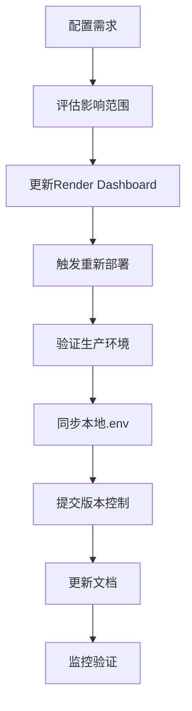
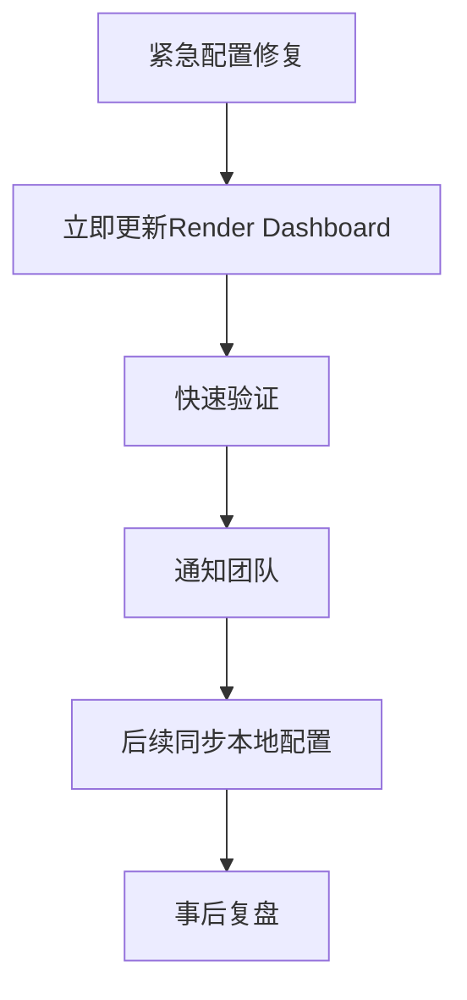

# GEO平台长期配置管理策略

## 🎯 核心原则

### 1. **单一真实来源 (Single Source of Truth)**
- **生产环境配置**: Render Dashboard Environment Variables
- **开发环境配置**: 本地.env文件
- **版本控制参考**: .env.production模板文件

### 2. **环境优先级层次**
```
1. Render Dashboard (最高优先级) - 生产环境实际运行值
2. 构建时环境变量 - CI/CD流程设置
3. .env文件 - 本地开发和参考
```

## 📋 配置分类管理

### 🔴 关键配置 (Critical)
**需要严格同步，变更需要审核**
- `AI_REQUEST_TIMEOUT_MS`
- `JWT_SECRET`
- `DATABASE_URL`
- `REDIS_URL`
- `API_KEYS`

### 🟡 重要配置 (Important)
**需要同步，变更需要记录**
- `NODE_ENV`
- `PORT`
- `OCR_TIMEOUT_MS`
- `CONTENT_QUEUE_TIMEOUT_MS`

### 🟢 一般配置 (Standard)
**可以差异化，需要文档说明**
- `LOG_LEVEL`
- `CACHE_TTL`
- `RATE_LIMITS`

## 🔄 配置更新工作流

### 标准更新流程


### 紧急更新流程


## 🛡️ 安全管理

### 敏感配置处理
- **绝不**将真实的API密钥、密码提交到版本控制
- 使用环境变量模板文件，敏感值用占位符
- 定期轮换JWT密钥和API密钥

### 访问控制
- Render Dashboard权限管理
- 环境变量变更审批流程
- 配置变更审计日志

## 📊 监控和验证

### 自动化验证
```bash
# 每日配置同步检查
node backend/verify_config_sync.js

# 部署前配置验证
npm run config:validate

# 生产环境配置健康检查
npm run config:health-check
```

### 监控指标
- 配置一致性检查通过率
- 配置变更频率
- 配置错误率
- 服务重启次数（配置变更导致）

## 🚀 最佳实践

### 1. **配置文件组织**
```
backend/
├── .env                    # 本地开发配置（不提交）
├── .env.example           # 配置模板
├── .env.production        # 生产配置模板
├── .env.test             # 测试环境配置
└── config/
    ├── verify_config_sync.js  # 验证脚本
    ├── load_config.js         # 配置加载器
    └── schema.json            # 配置模式定义
```

### 2. **变更管理**
- 所有配置变更都需要Pull Request
- 使用描述性的提交信息
- 记录变更原因和影响范围
- 设置配置变更的回滚计划

### 3. **版本控制策略**
```gitignore
# .gitignore
.env
.env.local
.env.*.local
```

```bash
# 允许提交的配置文件
.env.example
.env.production
.env.test
config/verify_config_sync.js
```

## 🔧 工具和自动化

### 1. **配置同步脚本**
- 自动检测配置不一致
- 生成同步报告
- 提供修复建议

### 2. **CI/CD集成**
```yaml
# .github/workflows/config-check.yml
name: Config Validation
on: [push, pull_request]
jobs:
  config-check:
    runs-on: ubuntu-latest
    steps:
      - uses: actions/checkout@v2
      - name: Validate Config Sync
        run: node backend/verify_config_sync.js
```

### 3. **部署钩子**
- 部署前自动验证配置
- 部署后检查服务健康
- 配置变更时发送通知

## 📈 性能优化

### 配置缓存
- 启动时加载配置到内存
- 避免频繁的文件I/O操作
- 实现配置热重载（非生产环境）

### 启动优化
- 验证关键配置值
- 提供默认值和验证规则
- 启动失败时提供清晰错误信息

## 🚨 故障处理

### 配置错误诊断
1. **服务启动失败**
   - 检查必需环境变量
   - 验证配置格式
   - 查看错误日志

2. **配置不一致**
   - 运行同步验证脚本
   - 比较各环境配置
   - 查看最近变更历史

3. **性能问题**
   - 检查超时配置
   - 验证连接池设置
   - 分析资源使用情况

### 应急恢复
```bash
# 快速回滚到上一个稳定配置
git checkout HEAD~1 -- .env.production

# 使用备份配置
cp backend/.env.backup backend/.env

# 重新部署
git push origin main
```

## 📚 文档和培训

### 配置文档
- 每个配置项的说明和默认值
- 环境特定的配置指南
- 配置变更操作手册

### 团队培训
- 配置管理最佳实践
- 安全配置的重要性
- 应急故障处理流程

---

## 🎯 执行检查清单

### 每月检查
- [ ] 运行配置同步验证
- [ ] 检查配置变更日志
- [ ] 审查配置访问权限
- [ ] 更新配置文档

### 季度检查
- [ ] 配置安全审计
- [ ] 性能配置优化
- [ ] 备份和恢复测试
- [ ] 团队培训更新

### 年度检查
- [ ] 配置架构审查
- [ ] 工具和流程升级
- [ ] 合规性检查
- [ ] 灾难恢复演练

---

**最后更新**: 2025-12-09
**负责人**: [您的姓名]
**审核人**: [团队负责人]