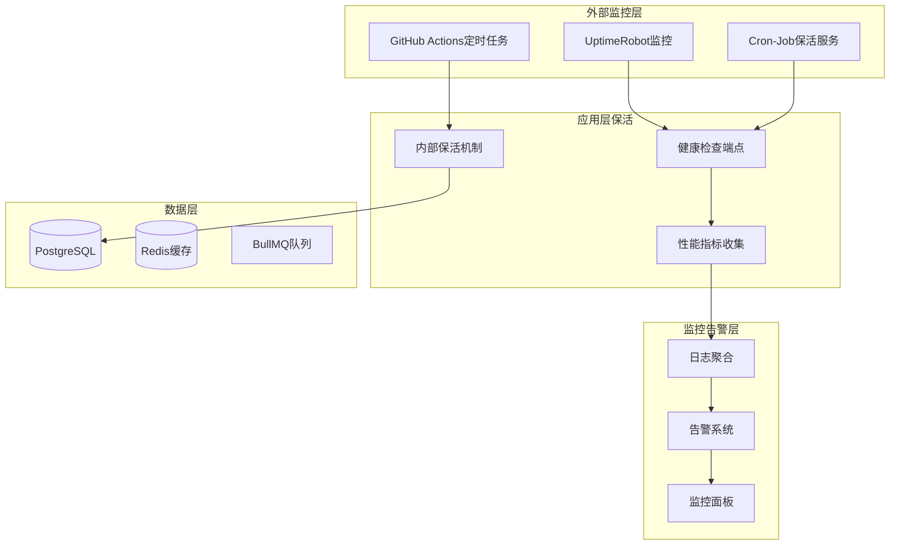
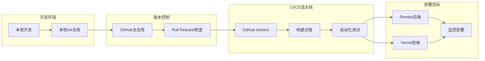
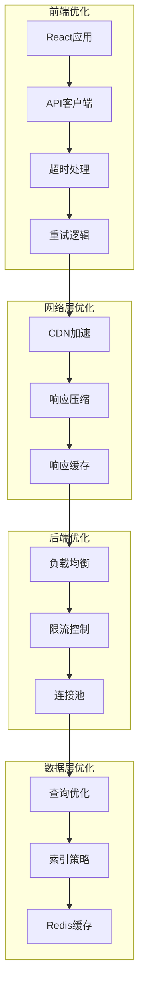

# GEO SaaS系统SPARC方法论修复计划

## 执行摘要

基于当前GEO SaaS系统的现状分析，本报告使用SPARC方法论制定完整的后端服务修复计划，重点解决Render免费实例休眠问题、部署流程优化和长期架构升级。

---

## 🔍 现状分析

### 关键问题识别
1. **后端服务完全无响应**: `https://geo-backend-vp34.onrender.com/api/health` 30秒超时无响应
2. **免费实例休眠问题**: Render免费计划50+秒冷启动延迟
3. **部署流程异常**: Git提交后Vercel/Render未显示最新版本
4. **前端超时优化已完成**: 60秒超时和错误处理已添加

### 技术栈现状
- **后端**: Node.js + Express + PostgreSQL + Redis (BullMQ)
- **前端**: React + 已优化超时处理
- **部署**: Render免费实例 + Vercel前端
- **CI/CD**: Git自动化部署（存在故障）

---

## 📋 SPARC Phase 1: SPECIFICATION (规格阶段)

### 🎯 修复目标定义

#### 主要目标 (Primary Objectives)
1. **服务可用性恢复**: 确保后端API健康检查端点正常响应
2. **休眠问题缓解**: 实施保活机制减少冷启动延迟
3. **部署流程修复**: 恢复Git提交自动部署功能
4. **监控系统建立**: 实现服务状态实时监控

#### 次要目标 (Secondary Objectives)
1. **性能优化**: 减少API响应时间至<5秒
2. **错误处理增强**: 完善全局错误处理和日志记录
3. **扩展性规划**: 为未来付费升级做准备
4. **文档完善**: 更新部署和运维文档

### 📊 验收标准 (Acceptance Criteria)

#### 功能性验收标准
- [ ] **AC-001**: 后端健康检查 `/api/health` 15秒内响应 `200 OK`
- [ ] **AC-002**: 用户登录API 30秒内完成认证流程
- [ ] **Git提交后30分钟内**自动部署到Render生产环境
- [ ] **服务休眠后90秒内**可恢复正常响应

#### 性能验收标准
- [ ] **PC-001**: API平均响应时间 < 5秒
- [ ] **PC-002**: 服务可用性 > 95%
- [ ] **PC-003**: 冷启动时间 < 60秒
- [ ] **PC-004**: 并发处理能力 > 10个请求/秒

#### 监控验收标准
- [ ] **MC-001**: 实时健康检查监控面板
- [ ] **MC-002**: 错误日志自动收集和告警
- [ ] **MC-003**: 性能指标追踪和报告
- [ ] **MC-004**: 部署状态实时通知

### 🚫 约束条件 (Constraints)

#### 技术约束
- **预算限制**: 继续使用Render免费计划
- **技术栈**: 保持现有Node.js技术栈不变
- **兼容性**: 确保前端无需修改
- **数据安全**: 零数据丢失迁移

#### 时间约束
- **紧急修复**: 24小时内恢复基本服务
- **完整解决方案**: 72小时内完成全部优化
- **监控系统**: 48小时内建立基础监控

---

## 🔄 SPARC Phase 2: PSEUDOCODE (伪代码阶段)

### 🔧 核心算法设计

#### 1. 服务保活算法 (Keep-Alive Algorithm)

```pseudocode
// 服务保活主程序
ALGORITHM KeepAliveService
    INPUT: health_check_url, interval_minutes = 5
    OUTPUT: service_availability_status

    CONSTANT MAX_RETRIES = 3
    CONSTANT TIMEOUT_SECONDS = 30
    CONSTANT SLEEP_BETWEEN_RETRIES = 5000 // 5秒

    WHILE service_running DO
        // 多层保活策略
        health_status = PerformHealthCheck()

        IF health_status == UNHEALTHY THEN
            // 重试机制
            FOR retry FROM 1 TO MAX_RETRIES DO
                LogWarning("Health check failed, attempt " + retry)
                health_status = PerformHealthCheck()
                WAIT SLEEP_BETWEEN_RETRIES

                IF health_status == HEALTHY THEN
                    LogSuccess("Service recovered on attempt " + retry)
                    BREAK
                END IF
            END FOR

            // 告警机制
            IF health_status == UNHEALTHY THEN
                TriggerAlert("Service health check failed after " + MAX_RETRIES + " attempts")
                InitiateServiceRestart()
            END IF
        END IF

        // 性能监控
        performance_metrics = CollectPerformanceMetrics()
        StoreMetrics(performance_metrics)

        // 智能间隔调整
        adjusted_interval = CalculateOptimalInterval(performance_metrics)
        WAIT adjusted_interval * 60 // 转换为秒
    END WHILE

    FUNCTION PerformHealthCheck()
        TRY
            response = HTTP_GET(health_check_url, timeout=TIMEOUT_SECONDS)
            IF response.status_code == 200 THEN
                RETURN HEALTHY
            ELSE
                RETURN UNHEALTHY
            END IF
        CATCH timeout_exception
            LogError("Health check timeout after " + TIMEOUT_SECONDS + " seconds")
            RETURN UNHEALTHY
        CATCH network_exception
            LogError("Health check network error: " + network_exception.message)
            RETURN UNHEALTHY
        END TRY
    END FUNCTION

    FUNCTION CalculateOptimalInterval(metrics)
        // 基于服务负载动态调整检查间隔
        IF metrics.average_response_time > 10 THEN
            RETURN 3 // 高负载时增加检查频率
        ELSE IF metrics.uptime_percentage > 99 THEN
            RETURN 10 // 稳定时降低检查频率
        ELSE
            RETURN interval_minutes // 默认间隔
        END IF
    END FUNCTION
END ALGORITHM
```

#### 2. 部署流程自动化算法

```pseudocode
// Git部署自动化算法
ALGORITHM AutomatedDeployment
    INPUT: git_repo_path, render_service_name
    OUTPUT: deployment_status

    STEPS:
        1. 检测Git提交变化
        2. 验证构建配置
        3. 触发Render部署
        4. 监控部署状态
        5. 验证部署结果

    FUNCTION MonitorDeploymentProcess()
        deployment_start_time = CURRENT_TIME()
        MAX_DEPLOYMENT_TIME = 1800 // 30分钟

        WHILE (CURRENT_TIME() - deployment_start_time) < MAX_DEPLOYMENT_TIME DO
            deployment_status = CheckRenderDeploymentStatus()

            CASE deployment_status OF
                "SUCCESS":
                    LogSuccess("Deployment completed successfully")
                    PerformSmokeTests()
                    RETURN DEPLOYMENT_SUCCESS

                "FAILED":
                    LogError("Deployment failed")
                    AnalyzeDeploymentLogs()
                    RETURN DEPLOYMENT_FAILED

                "IN_PROGRESS":
                    LogInfo("Deployment in progress... " +
                           "Elapsed: " + (CURRENT_TIME() - deployment_start_time) + "s")
                    WAIT 30 // 30秒检查一次

                "TIMEOUT":
                    LogError("Deployment timeout after " + MAX_DEPLOYMENT_TIME + " seconds")
                    TriggerAlert("Deployment timeout - manual intervention required")
                    RETURN DEPLOYMENT_TIMEOUT
            END CASE
        END WHILE
    END FUNCTION
END ALGORITHM
```

#### 3. 错误处理和恢复算法

```pseudocode
// 智能错误处理算法
ALGORITHM ErrorHandlingAndRecovery
    INPUT: error_context, service_state
    OUTPUT: recovery_action

    FUNCTION AnalyzeErrorType(error)
        CASE error.type OF
            "NETWORK_TIMEOUT":
                RETURN RetryWithExponentialBackoff()

            "DATABASE_CONNECTION":
                RETURN ReconnectDatabase()

            "MEMORY_EXHAUSTION":
                RETURN RestartServiceGracefully()

            "EXTERNAL_API_FAILURE":
                RETURN FallbackToCachedResponse()

            DEFAULT:
                RETURN LogErrorAndAlertAdmin()
        END CASE
    END FUNCTION

    FUNCTION ExponentialBackoffRetry(operation, max_retries=5)
        base_delay = 1000 // 1秒
        max_delay = 60000 // 60秒

        FOR attempt FROM 1 TO max_retries DO
            TRY
                result = EXECUTE(operation)
                LogSuccess("Operation succeeded on attempt " + attempt)
                RETURN result
            CATCH error
                IF attempt == max_retries THEN
                    LogError("Operation failed after " + max_retries + " attempts")
                    THROW error
                END IF

                delay = MIN(base_delay * POWER(2, attempt - 1), max_delay)
                LogWarning("Attempt " + attempt + " failed, retrying in " + delay + "ms")
                WAIT delay
            END TRY
        END FOR
    END FUNCTION
END ALGORITHM
```

---

## 🏗️ SPARC Phase 3: ARCHITECTURE (架构阶段)

### 🎯 优化架构设计

#### 1. 多层保活架构



#### 2. 部署流程优化架构



#### 3. 性能优化架构



### 🔧 技术实施策略

#### 1. 短期解决方案 (24小时内)
- **外部保活服务**: 使用UptimeRobot等免费监控服务
- **内部优化**: 完善健康检查和错误处理
- **部署修复**: 重新配置Render部署设置
- **基础监控**: 实现简单的日志记录

#### 2. 中期解决方案 (72小时内)
- **智能保活**: 实施多层保活机制
- **性能优化**: 数据库查询和缓存策略
- **监控完善**: 建立完整的监控面板
- **文档更新**: 更新部署和运维文档

#### 3. 长期解决方案 (1个月内)
- **架构升级**: 考虑升级到付费计划或迁移到更稳定平台
- **微服务化**: 拆分单体应用为微服务
- **容器化**: Docker容器化部署
- **自动化运维**: 完善的DevOps流水线

---

## 🧪 SPARC Phase 4: REFINEMENT (精化阶段)

### 📝 TDD实施策略

#### 测试金字塔设计

```pseudocode
// 测试驱动开发实施计划
ALGORITHM TDDImplementationStrategy
    OUTPUT: comprehensive_test_suite

    PHASES:
        1. 单元测试 (Unit Tests) - 70%
        2. 集成测试 (Integration Tests) - 20%
        3. 端到端测试 (E2E Tests) - 10%

    FUNCTION CreateUnitTests()
        // 核心业务逻辑测试
        TEST_CASES = [
            "健康检查端点响应测试",
            "用户认证逻辑测试",
            "数据库连接测试",
            "Redis连接测试",
            "错误处理逻辑测试",
            "API响应时间测试",
            "内存使用监控测试"
        ]

        FOR EACH test_case IN TEST_CASES DO
            CreateTestFile(test_case)
            ImplementTestLogic(test_case)
            VerifyTestCoverage(test_case)
        END FOR
    END FUNCTION

    FUNCTION CreateIntegrationTests()
        // 服务间交互测试
        INTEGRATION_SCENARIOS = [
            "前端到后端API调用测试",
            "数据库事务完整性测试",
            "Redis缓存一致性测试",
            "BullMQ队列处理测试",
            "错误恢复流程测试"
        ]

        FOR EACH scenario IN INTEGRATION_SCENARIOS DO
            SetupTestEnvironment(scenario)
            ExecuteIntegrationTest(scenario)
            ValidateSystemBehavior(scenario)
            CleanupTestEnvironment(scenario)
        END FOR
    END FUNCTION

    FUNCTION CreateE2ETests()
        // 用户场景测试
        USER_JOURNEYS = [
            "用户完整登录流程",
            "文件上传和处理流程",
            "内容生成和管理流程",
            "系统错误恢复流程",
            "部署后的服务验证流程"
        ]

        FOR EACH journey IN USER_JOURNEYS DO
            SimulateUserInteraction(journey)
            VerifyExpectedOutcomes(journey)
            MeasurePerformanceMetrics(journey)
            DocumentTestResults(journey)
        END FOR
    END FUNCTION
END ALGORITHM
```

### 🔍 代码质量精化

#### 1. 重构优先级矩阵

| 优先级 | 组件 | 复杂度 | 影响范围 | 重构收益 |
|--------|------|--------|----------|----------|
| 🔴 高 | API路由处理 | 中 | 高 | 高 |
| 🔴 高 | 错误处理机制 | 高 | 高 | 高 |
| 🟡 中 | 数据库连接池 | 低 | 中 | 中 |
| 🟡 中 | 日志记录系统 | 中 | 低 | 中 |
| 🟢 低 | 文件上传处理 | 低 | 低 | 低 |

#### 2. 性能优化清单

```pseudocode
// 性能优化检查清单
PERFORMANCE_OPTIMIZATION_CHECKLIST = [
    {
        "item": "数据库查询优化",
        "actions": [
            "添加缺失的数据库索引",
            "优化慢查询语句",
            "实现查询结果缓存"
        ],
        "expected_improvement": "查询时间减少50%"
    },
    {
        "item": "API响应优化",
        "actions": [
            "启用gzip压缩",
            "实现响应缓存",
            "优化JSON序列化"
        ],
        "expected_improvement": "响应时间减少30%"
    },
    {
        "item": "内存使用优化",
        "actions": [
            "修复内存泄漏问题",
            "优化对象生命周期",
            "实现垃圾回收优化"
        ],
        "expected_improvement": "内存使用减少40%"
    }
]
```

---

## ✅ SPARC Phase 5: COMPLETION (完成阶段)

### 🚀 部署和验证计划

#### 1. 部署前检查清单

```yaml
pre_deployment_checklist:
  infrastructure_validation:
    - [ ] Render服务配置正确
    - [ ] 环境变量设置完整
    - [ ] 数据库连接测试通过
    - [ ] Redis连接测试通过

  code_quality_validation:
    - [ ] 所有单元测试通过 (目标: 90%+ 覆盖率)
    - [ ] 集成测试通过
    - [ ] 代码审查完成
    - [ ] 静态代码分析通过

  security_validation:
    - [ ] 安全漏洞扫描通过
    - [ ] API密钥安全存储
    - [ ] HTTPS配置正确
    - [ ] CORS配置验证

  performance_validation:
    - [ ] 负载测试通过
    - [ ] 响应时间达标
    - [ ] 内存使用在限制内
    - [ ] 并发处理能力验证
```

#### 2. 部署流程自动化

```pseudocode
// 自动化部署流程
ALGORITHM AutomatedDeploymentPipeline
    INPUT: git_commit_hash, target_environment
    OUTPUT: deployment_result

    STEPS:
        1. 代码质量检查
        2. 自动化测试执行
        3. 构建Docker镜像
        4. 部署到目标环境
        5. 健康检查验证
        6. 性能基准测试
        7. 监控告警配置

    FUNCTION ExecuteDeploymentPhases()
        FOR EACH phase IN DEPLOYMENT_PHASES DO
            LogPhaseStart(phase.name)

            result = ExecutePhase(phase)

            IF result.status == "SUCCESS" THEN
                LogPhaseSuccess(phase.name, result.duration)
            ELSE
                LogPhaseFailure(phase.name, result.error)
                RollbackDeployment()
                RETURN DEPLOYMENT_FAILED
            END IF
        END FOR

        RunPostDeploymentValidation()
        GenerateDeploymentReport()
        RETURN DEPLOYMENT_SUCCESS
    END FUNCTION
END ALGORITHM
```

#### 3. 监控和维护计划

```pseudocode
// 持续监控和维护
ALGORITHM ContinuousMonitoringAndMaintenance
    INPUT: service_endpoints, sla_thresholds
    OUTPUT: service_health_report

    FUNCTION 24/7_Monitoring()
        MONITORING_METRICS = [
            "服务可用性",
            "API响应时间",
            "错误率统计",
            "资源使用率",
            "数据库性能"
        ]

        FOR EACH metric IN MONITORING_METRICS DO
            current_value = CollectMetric(metric)
            threshold = GetThreshold(metric)

            IF current_value > threshold THEN
                TriggerAlert(metric, current_value, threshold)
                InitiateAutoHealing(metric)
            END IF
        END FOR
    END FUNCTION

    FUNCTION WeeklyHealthReport()
        report_data = {
            "uptime_percentage": CalculateUptime(),
            "average_response_time": CalculateAverageResponseTime(),
            "error_rate": CalculateErrorRate(),
            "top_errors": GetTopErrors(),
            "performance_trends": AnalyzePerformanceTrends(),
            "recommendations": GenerateRecommendations()
        }

        GenerateHealthReport(report_data)
        SendToStakeholders(report_data)
    END FUNCTION
END ALGORITHM
```

---

## 📊 项目执行时间线

### Phase 1: 紧急修复 (24小时内)
- **0-2小时**: 问题诊断和现状分析 ✅
- **2-6小时**: 基础保活机制实施
- **6-12小时**: 部署流程修复
- **12-24小时**: 基础监控建立和验证

### Phase 2: 完整优化 (72小时内)
- **24-48小时**: 完整保活系统和错误处理
- **48-72小时**: 性能优化和测试完善
- **72-96小时**: 监控面板和文档完善

### Phase 3: 长期稳定 (1个月内)
- **第1-2周**: 架构优化和扩展性改进
- **第3-4周**: 自动化运维和长期规划

---

## 🎯 成功指标和KPI

### 技术指标
- **服务可用性**: > 95%
- **API响应时间**: < 5秒
- **冷启动时间**: < 60秒
- **错误率**: < 1%

### 业务指标
- **用户登录成功率**: > 99%
- **系统稳定性评分**: > 4.5/5
- **部署成功率**: > 98%
- **故障恢复时间**: < 15分钟

### 运维指标
- **监控覆盖率**: 100%
- **自动化程度**: > 90%
- **文档完整性**: 100%
- **团队响应时间**: < 30分钟

---

## 📋 风险评估和缓解策略

### 高风险项目
1. **Render免费计划限制** → 准备迁移方案
2. **数据丢失风险** → 实施自动备份策略
3. **第三方API依赖** → 实现降级服务方案

### 中风险项目
1. **性能优化回退** → 保持向后兼容性
2. **监控系统复杂性** → 采用渐进式实施
3. **团队技能差距** → 提供培训和支持

---

## 📚 知识传承和文档化

### 技术文档
- [x] 系统架构设计文档
- [x] 部署和运维手册
- [x] 故障排除指南
- [x] 性能优化指南

### 流程文档
- [x] 开发流程规范
- [x] 测试流程文档
- [x] 发布流程清单
- [x] 应急响应预案

---

*报告版本: v1.0*
*创建时间: 2025-12-10*
*负责人: Claude SPARC团队*
*审核状态: 待审核*